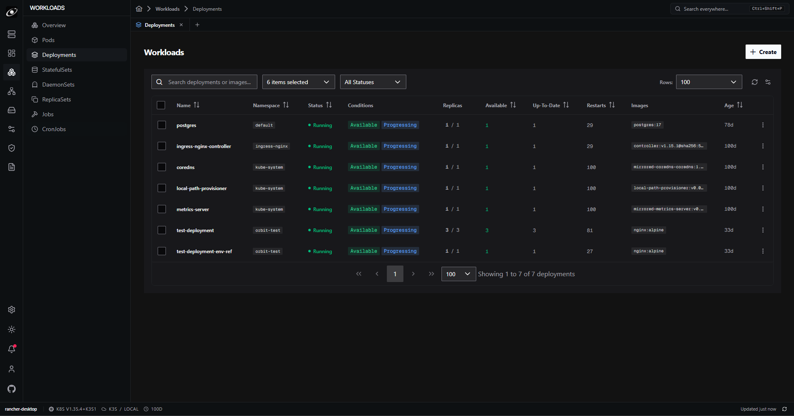

# Orbit 🛰️

<p align="center">
  <strong>A lightweight, native Kubernetes desktop dashboard built with Rust and Tauri.</strong>
</p>

<p align="center">
  <a href="https://github.com/vantoan1511/orbit/releases"></a>
  <a href="LICENSE"></a>
  <a href="https://www.rust-lang.org/"></a>
  <a href="https://tauri.app/"></a>
  <a href="https://vuejs.org/"></a>
  <a href="https://primevue.org/"></a>
</p>

---

Desktop Kubernetes management shouldn't require running a dedicated Chromium instance consuming 1–2 GB of RAM just to check a Pod status or inspect an ingress rule.

**Orbit** is built for engineers who want a snappy, native-feeling desktop experience without the Electron overhead. By pairing a compiled **Rust core engine** with **Tauri v2** (which utilizes your operating system's native webview), Orbit starts in milliseconds, sips memory, and keeps cluster operations isolated and fast.

<p align="center">
  
  <br />
  <em>Fast, compact, and designed for day-to-day cluster navigation.</em>
</p>

---

## ⚡ Why Orbit?

- **Compiled Rust Core**: High-throughput Kubernetes communication, streaming log parsers, and connection pools run in native Rust via `kube-rs` and `tokio`.
- **Zero Electron Overhead**: Built on [Tauri](https://tauri.app/). We hook into your OS's built-in webview instead of shipping an entire redundant browser binary.
- **Security by Isolation**: Kubeconfig credentials, certificates, and cluster tokens live exclusively within the local Rust process—never leaking into the frontend presentation layer.
- **IDE-Grade Density**: Dark-first, noir-inspired technical design powered by PrimeVue v4 (Nora preset). Information-dense, clean, and distraction-free.

---

## ✨ Features

### ☸️ Context & Namespace Navigation

- **Instant Context Switching**: Jump between local clusters (Kind, k3s, Minikube) and remote cloud environments without reload lag.
- **Isolated Namespace Scoping**: Filter resources globally or inspect multiple namespaces side-by-side with zero cross-cluster state bleed.
- **Connection Diagnostics**: Immediate visual status when a cluster or control plane endpoint is degraded or unreachable.

### 📦 Comprehensive Resource Explorer

- **Workloads**: Inspect Deployments, Pods, StatefulSets, DaemonSets, Jobs, CronJobs, and ReplicaSets with live health indicators.
- **Configuration & Storage**: Deep-dive into ConfigMaps, Secrets, HPAs, PersistentVolumes, PVCs, and StorageClasses.
- **Network & Security**: Audit Services, Ingress routes, NetworkPolicies, ResourceQuotas, and LimitRanges.
- **Cluster Infrastructure**: Review Nodes, Namespaces, and system-wide cluster events.

### 📝 Integrated Monaco YAML & Direct Apply

- **Live Manifest Editor**: Syntax-highlighted YAML editing powered by Monaco Editor with real-time Kubernetes schema awareness.
- **Diff & In-App Apply**: Review edits and apply updates directly to the cluster with structured feedback and validation errors.

### 📊 Real-Time Logs & Cluster Events

- **Pod Log Streaming**: Follow live container output with multi-container tab switching and text filtering.
- **Event Timeline**: Filter warnings, container crashes, and lifecycle events across namespaces in real time.

### 🔌 Persistent Port Forwarding

- **Background Tunnels**: Manage port forwarding sessions directly from pod or service views. Sessions cleanly persist across view changes.

---

## 🏗️ Architecture

Orbit maintains a clean separation of concerns between frontend rendering and backend system interaction:

```
┌─────────────────────────────────────────────────────────┐
│                    Vue 3 Frontend                       │
│  - Composition API + TypeScript                         │
│  - PrimeVue v4 (Nora Theme) + Tailwind CSS v4           │
│  - View State, Monaco YAML Editor, UI Interactions      │
└────────────────────────────┬────────────────────────────┘
                             │ Tauri v2 IPC
┌────────────────────────────▼────────────────────────────┐
│                  Rust Host & Backend                    │
│  - `src-tauri`: Tauri v2 application host & plugins     │
│  - In-process: Kubernetes client, kubeconfig, Cache     │
│  - Privileged OS, Network & Filesystem operations       │
└─────────────────────────────────────────────────────────┘
```

- **Frontend (`src/`)**: Pure presentation layer communicating strictly across strongly typed IPC contracts.
- **Backend (`src-tauri`)**: In-process Rust engine handles all Kubernetes client logic, token resolution, and background workers.
- **IPC Protocol**: Strongly typed request/response structs preventing runtime desynchronization and secret leakage.

---

## 🛠️ Tech Stack

| Layer                     | Technology                                                                                  |
| ------------------------- | ------------------------------------------------------------------------------------------- |
| **Desktop Runtime**       | [Tauri v2](https://tauri.app/)                                                              |
| **Backend Engine**        | [Rust](https://www.rust-lang.org/) (`kube-rs`, `tokio`, `serde`)                            |
| **Frontend Framework**    | [Vue 3](https://vuejs.org/) (Composition API, TypeScript)                                   |
| **UI Components & Theme** | [PrimeVue v4](https://primevue.org/) (Nora Preset)                                          |
| **Styling**               | [Tailwind CSS v4](https://tailwindcss.com/)                                                 |
| **State Management**      | [Pinia](https://pinia.vuejs.org/)                                                           |
| **Editor**                | [Monaco Editor](https://microsoft.github.io/monaco-editor/) via `@guolao/vue-monaco-editor` |
| **Icons**                 | [Lucide Vue](https://lucide.dev/)                                                           |
| **Build Tool**            | [Vite](https://vite.dev/)                                                                   |

---

## 💾 Installation

### Windows

1. Head over to the [Releases](https://github.com/vantoan1511/orbit/releases) page.
2. Grab the latest `Orbit-Setup-x.y.z.exe` installer or MSI package.
3. Run the installer to get up and running.

> _macOS and Linux builds are currently in progress._

---

## 💻 Local Development

### Prerequisites

- [Node.js](https://nodejs.org/) (`>= 20.19.0` or `>= 22.12.0`)
- [Rust](https://www.rust-lang.org/) (Stable toolchain)

### Quickstart

1. **Clone the repo:**

   ```bash
   git clone https://github.com/vantoan1511/orbit.git
   cd orbit
   ```

2. **Install frontend dependencies:**

   ```bash
   npm install
   ```

3. **Launch development mode:**
   ```bash
   npm run tauri:dev
   ```

### Available Scripts

| Command              | Description                                                                      |
| -------------------- | -------------------------------------------------------------------------------- |
| `npm run dev`        | Starts the Vite development server                                               |
| `npm run tauri:dev`  | Launches the Tauri desktop client in development mode                            |
| `npm run tauri:build`| Builds production desktop bundle (NSIS installer and MSI)                        |
| `npm run build`      | Type-checks and builds frontend production assets                                |
| `npm run type-check` | Runs `vue-tsc` to validate TypeScript across Vue components and source files     |
| `npm run test`       | Runs unit tests using Node 24 native test runner                                 |
| `npm run lint`       | Lints and fixes source files with ESLint                                         |
| `npm run format`     | Formats the codebase using Prettier                                              |

---

## 🤝 Contributing

Contributions, bug reports, and ideas are always welcome.

1. Fork the repository
2. Create your branch (`git checkout -b feat/your-feature` or `fix/issue-description`)
3. Commit your changes (`git commit -m 'feat: add support for custom CRDs'`)
4. Push to your branch (`git push origin feat/your-feature`)
5. Open a Pull Request

Check open [issues](https://github.com/vantoan1511/orbit/issues) for planned roadmap items and bug fixes.

---

## ⚖️ License

Distributed under the [MIT License](LICENSE). Copyright &copy; 2026 Toan Nguyen.
